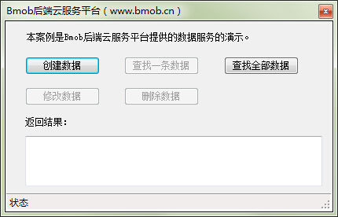
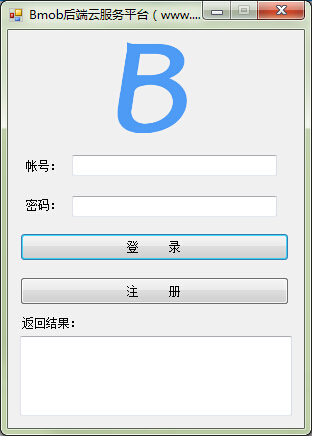
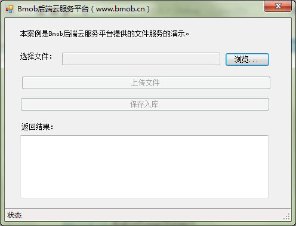
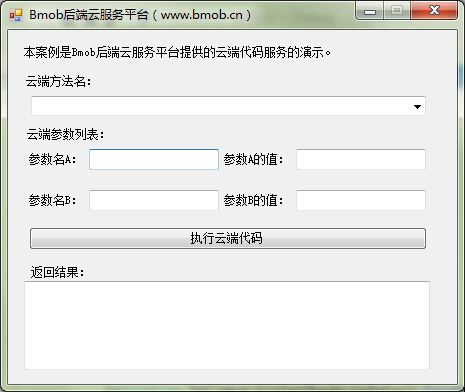

# Bmob C# for Windows案例
为方便大家使用Bmob C# SDK开发Windows桌面应用，官方编写了这个案例。案例分模块地对各项服务进行详细阐述，目前包括数据的基础服务（BmobDataForm）、用户服务（BmobUserForm）、文件服务（BmobFileUploadForm）和云端代码（BmobCloudCode）。

【注】所有Demo采用VS Express 2012 for Windows Destop版本开发，开发工具下载地址为：http://www.microsoft.com/zh-CN/download/details.aspx?id=34673

# Bmob官方信息

官方网址：[http://www.bmob.cn](http://www.bmob.cn)

问答社区：[http://wenda.bmob.cn](http://wenda.bmob.cn)

技术邮箱：support@bmob.cn
