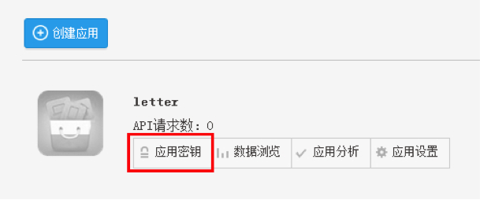
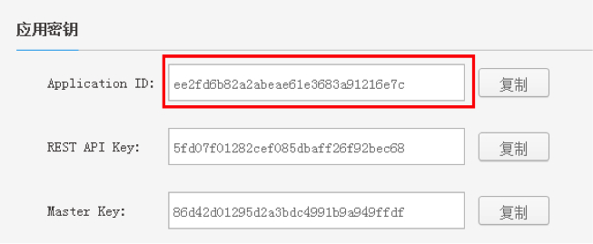
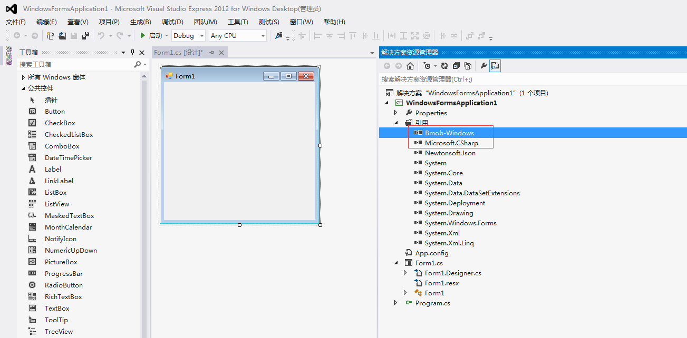

# Bmob C# SDK for Windows开发快速入门
## 注册Bmob帐号
在网址栏输入 www.bmob.cn 或者在百度输入“Bmob后端云”进行搜索，打开Bmob官网后，点击右上角的“注册”，在跳转页面填入你的姓名、邮箱、设置密码，确认后到你的邮箱激活Bmob账户，你就可以用Bmob轻松开发应用了。
## 网站后台创建应用

登录账号进入bmob后台后，点击后台界面左上角“创建应用”，在弹出框输入你应用的名称，然后确认，你就拥有了一个等待开发的应用。


## 获取应用密钥

选择你要开发的应用，点击该应用下方对应的“应用密钥”



在跳转页面，获取`Application ID`，此ID将会在初始化SDK中使用到。



## 下载安装SDK

Bmob C# SDK下载地址：[http://www.bmob.cn/site/sdk#unity_sdk](http://www.bmob.cn/site/sdk#unity_sdk)

下载后解压，将Windows文件夹下的`Bmob-Windows.dll`和`Newtonsoft.Json.dll`两个文件引用到你的项目工程中，如下图所示。



## 新建模型类

要想对Bmob云端的数据进行操作，需要创建和数据表对应的模型类。在Bmob中，模型类需要继承自`BmobTable`，类的实现如下。

```

//Game表对应的模型类
    class GameObject : BmobTable
    {

        private String fTable;
        //以下对应云端字段名称
        public BmobInt score { get; set; }
        public String playerName { get; set; }
        public BmobBoolean cheatMode { get; set; }

        //构造函数
        public GameObject() { }

        //构造函数
        public GameObject(String tableName)
        {
            this.fTable = tableName;
        }

        public override string table
        {
            get
            {
                if (fTable != null)
                {
                    return fTable;
                }
                return base.table;
            }
        }

        //读字段信息
        public override void readFields(BmobInput input)
        {
            base.readFields(input);

            this.score = input.getInt("score");
            this.cheatMode = input.getBoolean("cheatMode");
            this.playerName = input.getString("playerName");
        }

        //写字段信息
        public override void write(BmobOutput output, bool all)
        {
            base.write(output, all);

            output.Put("score", this.score);
            output.Put("cheatMode", this.cheatMode);
            output.Put("playerName", this.playerName);
        }
    }

```

## 初始化AppKey

在正式对Bmob后端云进行操作之前，需要先初始化AppKey信息，也就是初始化之前获取的`Application ID`信息，实现代码如下。

```
//创建Bmob实例
private BmobWindows bmob;

public BmobBaseForm()
            : base()
{
	bmob = new BmobWindows();

	//初始化ApplicationId，这个ApplicationId需要更改为你自己的ApplicationId
    Bmob.initialize("69015a79796397f7701454336b84e0c4");

    //注册调试工具
    BmobDebug.Register(msg => { Debug.WriteLine(msg); });
}

public BmobWindows Bmob
{
	get { return bmob; }
}

```

## 添加一行数据

初始化AppKey之后，我们就可以对Bmob云数据库进行操作了。下面以添加一行数据为例进行说明，实现代码如下。


```
//对应要操作的数据表
public const String TABLE_NAME = "Game";
//接下来要操作的数据的数据
private GameObject gameObject = new GameObject(TABLE_NAME);


private void createData_Click(object sender, EventArgs e)
{
	//设置值    
    System.Random rnd = new System.Random();
    gameObject.score = rnd.Next(-50, 170);
    gameObject.playerName = "123";
    gameObject.cheatMode = false;

    //保存数据
    var future = Bmob.CreateTaskAsync(gameObject);
	//异步显示返回的数据
    FinishedCallback(future.Result, resultText);
}

```

## 更多例子

大家可详细查看源码：https://github.com/bmob/bmob-demo-csharp/ ，了解更多的Bmob C# SDK for Windows的操作。